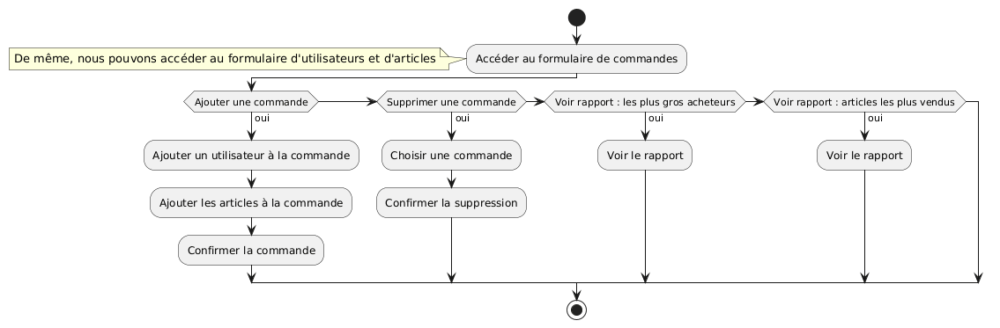
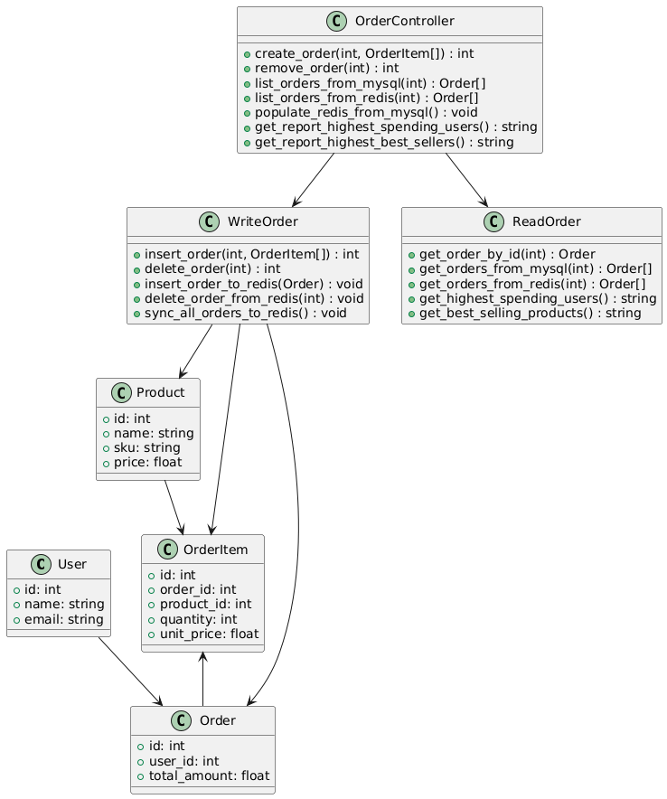
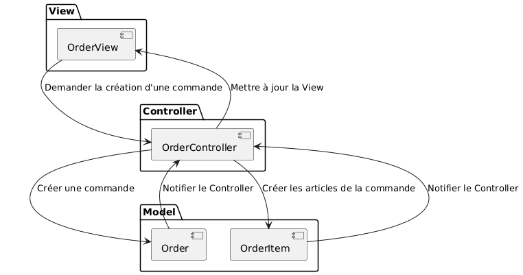
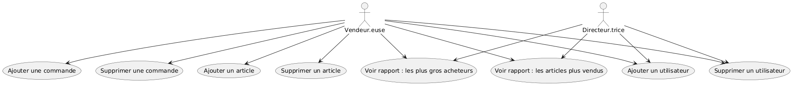
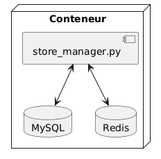

# Store Manager L02 - Documentation d'Architecture
Ce document, basé sur le modèle arc42, décrit une application de gestion de magasin pour le Labo 02, LOG430.

## 1. Introduction et Objectifs

### Panorama des exigences
L'application « Store Manager » est un système monolithique avec interface Web pour la gestion des commandes, articles et utilisateurs dans un magasin. Elle sert de projet éducatif pour démontrer :
- L'implémentation d'une architecture monolithique
- L'implémentation des concepts DDD (Domain-Driven Design)
- Le patron CQRS (Command Query Responsibility Segregation) pour séparer les opérations de lecture et d'écriture
- La persistance polyglotte avec MySQL et Redis pour optimiser les performances
- L'utilisation d'un ORM (SQLAlchemy) pour faciliter l'interaction avec les bases de données

### Objectifs qualité
| Priorité | Objectif qualité | Scénario |
|----------|------------------|----------|
| 1 | **Performance** | Optimisation des opérations de lecture via Redis pour supporter une charge élevée |
| 2 | **Maintenabilité** | Séparation claire entre commandes et requêtes via CQRS |
| 3 | **Évolutivité** | Support de multiples types de rapports statistiques sans impact sur MySQL |

### Parties prenantes (Stakeholders)
- **Développeur.euses** : Apprendre/enseigner l'architecture monolithique, CQRS, DDD et la persistance polyglotte
- **Employé.es du magasin** : Utilisateur.trices gérant les commandes, articles et utilisateurs dans l'interface Web
- **Gestionnaires du magasin** : Utilisateur.trices consultant les rapports statistiques (top acheteurs, articles populaires)

## 2. Contraintes d'architecture

| Contrainte | Description |
|------------|-------------|
| **Technologie** | Utilisation de Python 3, MySQL, Redis et SQLAlchemy |
| **Déploiement** | Utilisation de Docker et fichier .env pour la configuration |
| **Éducatif** | L'application doit démontrer clairement CQRS, la persistance polyglotte et l'optimisation des performances |

## 3. Portée et contexte du système

### Contexte métier

Le système permet aux employés du magasin de :
- Gérer les commandes (création, modification, suppression)
- Gérer les comptes utilisateurs
- Gérer les articles vendus par le magasin
- Générer des rapports statistiques optimisés

### Contexte technique
- **Interface** : Application Web Python.
- **Couche CQRS** : Séparation entre `commands/` (écriture) et `queries/` (lecture).
- **Concepts DDD** : Implementation des patrons Value Object et Repository. Utilisation des transactions dans les opérations de base de données pour garantir la cohérence des données.
- **Persistance polyglotte** : MySQL avec SQLAlchemy pour les écritures, Redis pour les lectures optimisées.
- **Synchronisation** : Mécanismes automatiques entre MySQL et Redis.

## 4. Stratégie de solution

| Problème | Approche de solution |
|----------|---------------------|
| **Performance de lecture** | Utilisation de Redis comme cache avec synchronisation automatique |
| **Séparation des responsabilités** | Patron CQRS avec dossiers `commands/` et `queries/` dédiés |
| **Gestion des données** | ORM SQLAlchemy pour MySQL, méthodes Redis pour le cache |
| **Rapports statistiques** | Traitement direct depuis Redis pour éviter la charge sur MySQL |

## 5. Vue des blocs de construction

## 6. Vue d'exécution

## 7. Vue de déploiement

## 8. Concepts transversaux
- Patron CQRS (Command Query Responsibility Segregation)
- Persistance polyglotte (MySQL + Redis)
- Concepts DDD (Domain-Driven Design)
- ORM (Object-Relational Mapping) avec SQLAlchemy
- Synchronisation de données temps réel

## 9. Décisions d'architecture
Veuillez consulter le fichier `/docs/adr/adr001.md`.

## 10. Exigences qualité

### Performance
- Temps de réponse optimisé pour les requêtes Redis
- Support de charges élevées simultanées
- Rapports statistiques générés sans impact sur MySQL

### Maintenabilité
- Séparation claire CQRS entre commands/ et queries/
- Code modulaire avec responsabilités bien définies
- Synchronisation automatique et cohérence des bases de données

### Évolutivité
- Architecture préparée pour l'ajout de nouveaux types de rapports
- Extensibilité du système de cache Redis
- Support de nouvelles entités métier

## 11. Risques et dettes techniques
Non applicable pour cette application.

## 12. Glossaire

| Terme | Définition |
|-------|------------|
| **CQRS** | Command Query Responsibility Segregation : séparation des opérations de lecture et d'écriture |
| **DDD** | Domain-Driven Design : approche de conception logicielle qui nous permet de gérer la complexité d'une application en séparant les responsabilités par domaine et en utilisant la conception tactique et stratégique |
| **ORM** | Object-Relational Mapping : technique de mapping entre objets et base de données relationnelle |
| **Persistance polyglotte** | Utilisation de plusieurs technologies de stockage pour différents besoins |